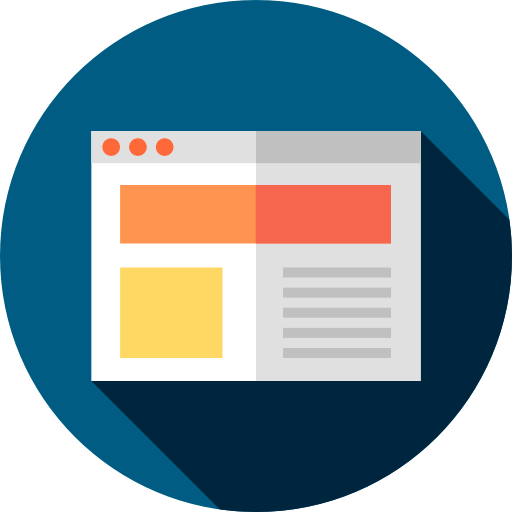

<!--
*** Thanks for checking out this README Template. If you have a suggestion that would
*** make this better, please fork the repo and create a pull request or simply open
*** an issue with the tag "enhancement".
*** Thanks again! Now go create something AMAZING! :D
-->

<!-- PROJECT LOGO -->
 

  

  <h3 align="center">Simple template portfolio</h3>

  

    Simple portfolio template with Html and CSS for customization
     
    <a href="https://github.com/DiegoOrejuela/simple-template-portfolio"><strong>Explore the docs »</strong></a>
     
     
    <a href="https://diegoorejuela.github.io/simple-template-portfolio/">View Demo</a>
    ·
    <a href="https://github.com/DiegoOrejuela/simple-template-portfolio/issues">Report Bug</a>
    ·
    <a href="https://github.com/DiegoOrejuela/simple-template-portfolio/issues">Request Feature</a>
  

<!-- TABLE OF CONTENTS -->
## Table of Contents

* [About the Project](#about-the-project)
  * [Built With](#built-with)
  * [Prerequisites](#prerequisites)
* [Usage](#usage)
* [Roadmap](#roadmap)
* [Contributing](#contributing)
* [Contact](#contact)
* [Acknowledgements](#acknowledgements)

<!-- ABOUT THE PROJECT -->
## About The Project

There are many great portfolio templates available on web, however, sometimes we could like some simple and functional, so that later it is personalized as you like.

Here's why:
* Your time should be focused on creating something amazing. A project that solves a problem and helps others
* You shouldn't be doing the same tasks over and over like creating a web portfolio from scratch
* You should element DRY principles to the rest of your life :smile:

### Built With

* HTML
* CSS

### Prerequisites

This project is aimed at people who know the basic concepts of HTML and CSS. If not, you can even follow it with a little intuition, and why not, you want to learn more about these web tools.

<!-- USAGE -->
## Usage

You just have to clone the repository and start changing the images and add information about yourself and your projects and experiences. The rest is already how you like.

## Some Amazing examples

If you need inspiration, you can see some portfolios web:
- https://luisvalladaresc.github.io/portafolio-ejemplo/?#portafolio
- https://leonardopa9.github.io/FitnessTech.github.io/porcentaje_masa_corporal.html
- https://manuelalvarezco.github.io/manuelalvarezco/

<!-- ROADMAP -->
## Roadmap

See the [open issues](https://github.com/othneildrew/Best-README-Template/issues) for a list of proposed features (and known issues).

<!-- CONTRIBUTING -->
## Contributing

Contributions are what make the open source community such an amazing place to be learn, inspire, and create. Any contributions you make are **greatly appreciated**.

1. Fork the Project
2. Create your Feature Branch (`git checkout -b feature/AmazingFeature`)
3. Commit your Changes (`git commit -m 'Add some AmazingFeature'`)
4. Push to the Branch (`git push origin feature/AmazingFeature`)
5. Open a Pull Request

<!-- CONTACT -->
## Contact

Diego Orejuela - [@DiegoOrejuela2](https://twitter.com/DiegoOrejuela2) - dfrodriguezor@gmail.com

<!-- ACKNOWLEDGEMENTS -->
## Acknowledgements
The origin of this idea was the Platzi [Web Online Development course](https://platzi.com/clases/html5-css3/). Thank you very much [@LeonidasEsteban](https://twitter.com/LeonidasEsteban).

